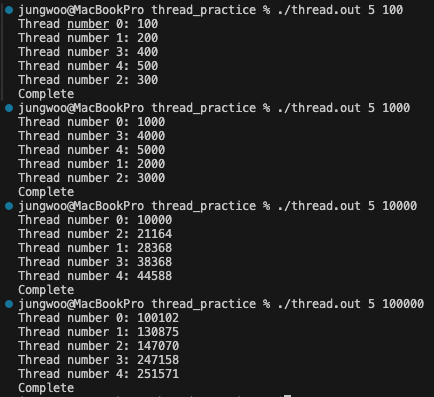
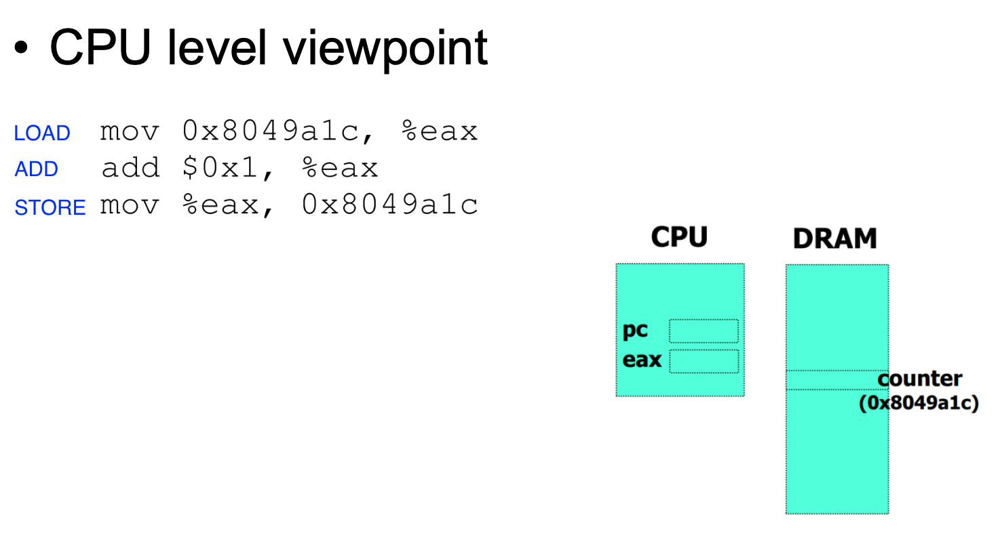

## header
`#include <pthread.h>`

## function
### pthread_create()
> similar to fork(), thread exits when the passed function reach the end.

```c
int pthread_create(pthread_t *restrict thread, const pthread_attr_t *restrict attr, 
                   void *(*start_routine)(void *), void *restrict arg);
```
- arg1) thread structure to interact with this thread,
- arg2) attribute of the thread such as priority and stack size, in most case it is NULL (use default)
- arg3) function pointer for start routine
- arg4) arguments

    ```c
    pthread_t tid_send, tid_recv;

    if (pthread_create(&tid_send, NULL, send_thread, &targ) != 0) {
        log_write("ERROR", "Failed to create send_thread (errno=%d: %s)",
                    errno, strerror(errno));
        close(sock);
        log_close();
        return 1;
    }
    ```

### pthread_join()
> similar to wait(), for synchronization

```c
int pthread_join(pthread_t thread, void **retval);
```
- arg1) thread structure, which is initialized by the thread creation routine
- arg2) a pointer to the return value (NULL means "don't care")

    ```c
    pthread_join(tid_send, NULL);
    ```

## thread unlock

| result | CPU level viewpoint |
|--------|---------------------|
|||